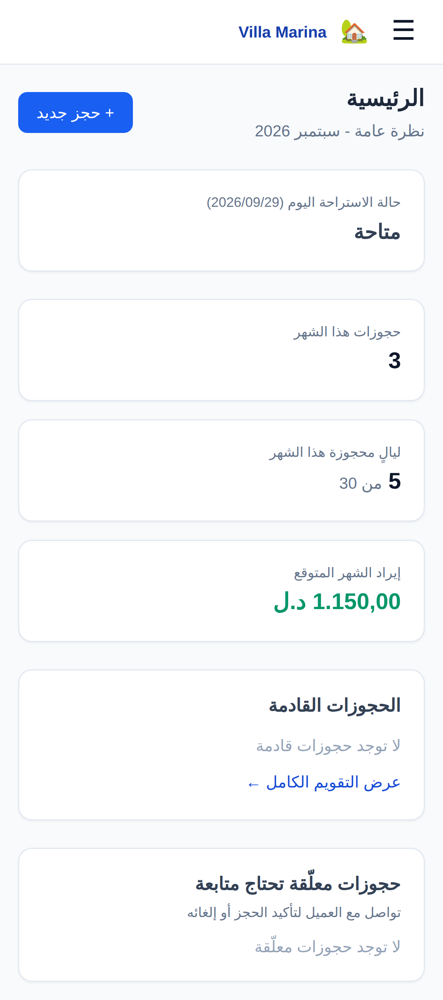
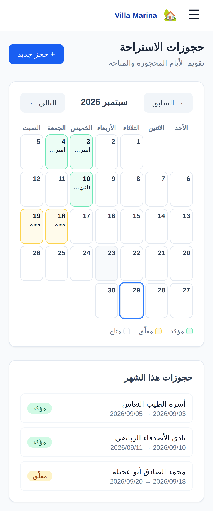
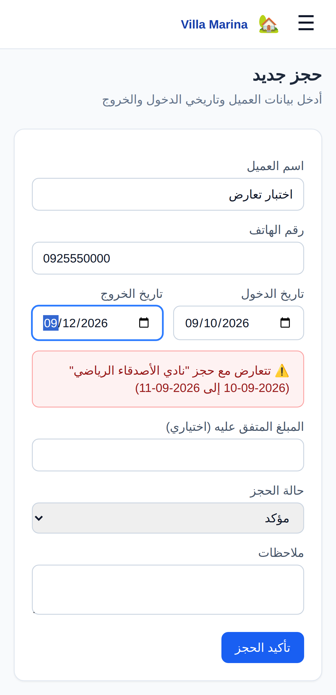
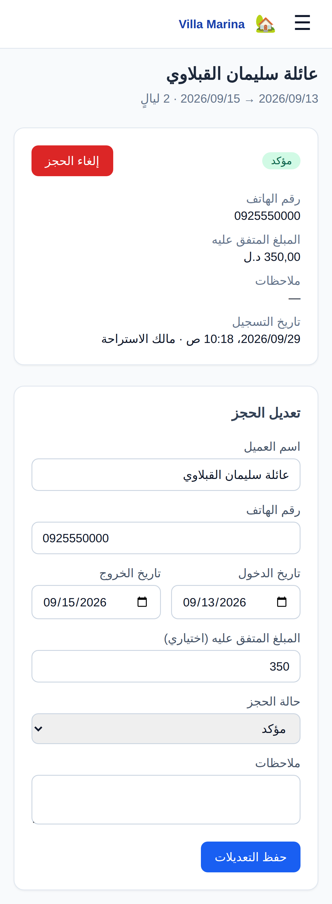

# 🏡 Villa Marina — نظام حجوزات الاستراحة

تطبيق ويب يعمل على الهاتف والحاسوب لإدارة حجوزات استراحة Villa Marina
للإيجار اليومي: تقويم واضح للأيام المحجوزة والمتاحة، تسجيل حجز جديد بسهولة،
ومنع أي حجزين متعارضين لنفس الأيام بشكل قاطع.

| الرئيسية | التقويم | حجز جديد (تعارض) | تفاصيل الحجز |
|---|---|---|---|
|  |  |  |  |

## ماذا يفعل النظام

- **الرئيسية**: هل الاستراحة مشغولة اليوم أو متاحة، أرقام الشهر (عدد
  الحجوزات، الليالي المحجوزة، الإيراد المتوقع)، الحجوزات القادمة، والحجوزات
  المعلّقة اللي تحتاج متابعة مع رقم هاتف العميل.
- **تقويم شهري**: أخضر = مؤكد، أصفر = معلّق، أبيض = متاح. الضغط على يوم
  محجوز يفتح تفاصيله، والضغط على يوم متاح يفتح حجزاً جديداً بذلك التاريخ.
- **حجز جديد مع تحقق فوري**: بمجرد اختيار التاريخين يظهر فوراً هل الفترة
  متاحة أو متعارضة (مع اسم الحجز المتعارض). ونفس الفحص يُعاد **إلزامياً على
  الخادم** قبل الحفظ، فلا يمكن حفظ حجزين متعارضين حتى لو أُرسل الطلبان في
  نفس اللحظة.
- **تعديل وإلغاء**: الإلغاء (بعد تأكيد) لا يحذف الحجز - يبقى في السجل، وتعود
  أيامه متاحة فوراً. الإلغاء نهائي: الحجز الملغى لا يُعدَّل.
- **المستخدمون**: المالك يضيف حسابات موظفيه، يوقفها، ويعيد تعيين كلمات
  مرورها. إيقاف حساب أو تغيير دوره يسري **فوراً** حتى على من هو مسجّل دخوله.
- **الأمان**: 5 محاولات دخول خاطئة لنفس البريد توقف المحاولة 15 دقيقة، ورسالة
  الخطأ لا تكشف إن كان البريد مسجّلاً. كل الأوقات بتوقيت ليبيا.

### الصلاحيات

| الدور | عرض | إنشاء/تعديل/إلغاء حجز | إدارة المستخدمين |
|---|---|---|---|
| مالك / مدير (`ADMIN`) | ✅ | ✅ | ✅ |
| موظف (`STAFF`) | ✅ | ✅ | ❌ |
| اطلاع فقط (`VIEWER`) | ✅ | ❌ | ❌ |

### قاعدة التعارض

`checkOutDate` هو يوم تسليم الاستراحة (اليوم التالي لآخر ليلة). حجزان غير
ملغيين يتعارضان إذا اشتركا في ليلة واحدة على الأقل - فحجز يبدأ في نفس يوم
خروج حجز آخر **مسموح**. الحجز "المعلّق" يحجز الأيام تماماً كالمؤكد لحين
تأكيده أو إلغائه. القاعدة في [`src/lib/dates.ts`](src/lib/dates.ts) (مغطّاة
باختبارات في [`src/lib/dates.test.ts`](src/lib/dates.test.ts))، وتفرضها قاعدة
البيانات نفسها بقيد `rental_bookings_no_overlap` - فحتى طلبا حفظ في نفس اللحظة
تماماً لا يمكن أن يُحفظا معاً.

## التقنية

Next.js 14 (App Router) + TypeScript · PostgreSQL + Prisma · Tailwind CSS
(عربي RTL، مصمَّم للهاتف أولاً) · جلسات JWT في كوكي `httpOnly` · كلمات مرور
`bcrypt`.

## التشغيل المحلي

```bash
npm install
docker compose up -d          # PostgreSQL محلية (أو أي PostgreSQL 16)
cp .env.example .env          # ثم عدّل AUTH_SECRET لقيمة عشوائية طويلة
npx prisma migrate deploy     # إنشاء الجداول
npm run db:seed               # (اختياري) حسابات وحجوزات تجريبية
npm run dev                   # http://localhost:3000
```

حسابات تجريبية بعد `db:seed` (كلمة المرور `ChangeMe123!` — **غيّرها فوراً**):

| البريد | الدور |
|---|---|
| admin@villamarina.ly | مالك / مدير |
| staff@villamarina.ly | موظف |

الفحوصات:

```bash
npm run typecheck
npm test
npm run build
```

## النشر أونلاين (رابط يُفتح من الهاتف)

الطريقة الموصى بها: **Vercel** (استضافة) + **Neon** (قاعدة بيانات) - كلاهما
مجاني للبداية.

1. **Neon** ([neon.tech](https://neon.tech)): أنشئ مشروعاً، وانسخ رابط الاتصال
   *Pooled* (يحتوي `-pooler`). الرابط *Direct* هو نفسه بدون `-pooler`.
2. **Vercel** ([vercel.com](https://vercel.com)): سجّل بحساب GitHub ←
   *Add New → Project* ← اختر هذا المستودع، وأضف متغيرات البيئة:

   | المتغير | القيمة |
   |---|---|
   | `DATABASE_URL` | رابط Neon الـ Pooled + `&pgbouncer=true` في آخره |
   | `DIRECT_URL` | نفس الرابط بدون `-pooler` |
   | `AUTH_SECRET` | نص عشوائي طويل (32 حرفاً فأكثر) |
   | `ADMIN_INITIAL_PASSWORD` | كلمة مرور حساب المالك الأولى (12 حرفاً فأكثر) |
   | `CURRENCY_LABEL` | `د.ل` |

   ثم *Deploy*.

كل نشر يشغّل تلقائياً (سكربت `vercel-build`): تطبيق ترحيلات قاعدة البيانات،
ثم إنشاء حساب المالك `admin@villamarina.ly` **في أول نشر فقط** (بدون أي
حجوزات أو حسابات تجريبية)، ثم بناء التطبيق - لا حاجة لتشغيل أي أمر يدوياً.
ادخل بحساب المالك وغيّر كلمة المرور من "إعدادات الحساب"، ثم أضف موظفيك من
"المستخدمون".

## الوثائق

- [وثيقة المتطلبات الوظيفية](docs/requirements.md)
- [مخططات UML (قاعدة البيانات وتدفق العمل)](docs/uml.md)
- [خطة الاختبار](docs/test-plan.md)
- [دليل الاستخدام](docs/user-guide.md)

## بنية المشروع

```
prisma/schema.prisma      # User, AuditLog, RentalBooking
prisma/seed.ts            # بيانات تجريبية
src/lib/dates.ts          # منطق التواريخ والتعارض (بلا قاعدة بيانات، آمن للمتصفح)
src/lib/rental.ts         # استعلام الحجوزات المتعارضة (للخادم فقط)
src/lib/auth.ts, rbac.ts  # الجلسات والصلاحيات
app/page.tsx              # الرئيسية
app/rentals/              # التقويم، حجز جديد، تفاصيل/تعديل/إلغاء
app/api/rentals/availability/  # التحقق الفوري من التوفر
app/users/, app/account/  # إدارة المستخدمين، إعدادات الحساب
middleware.ts             # حماية كل الصفحات بتسجيل الدخول
```
