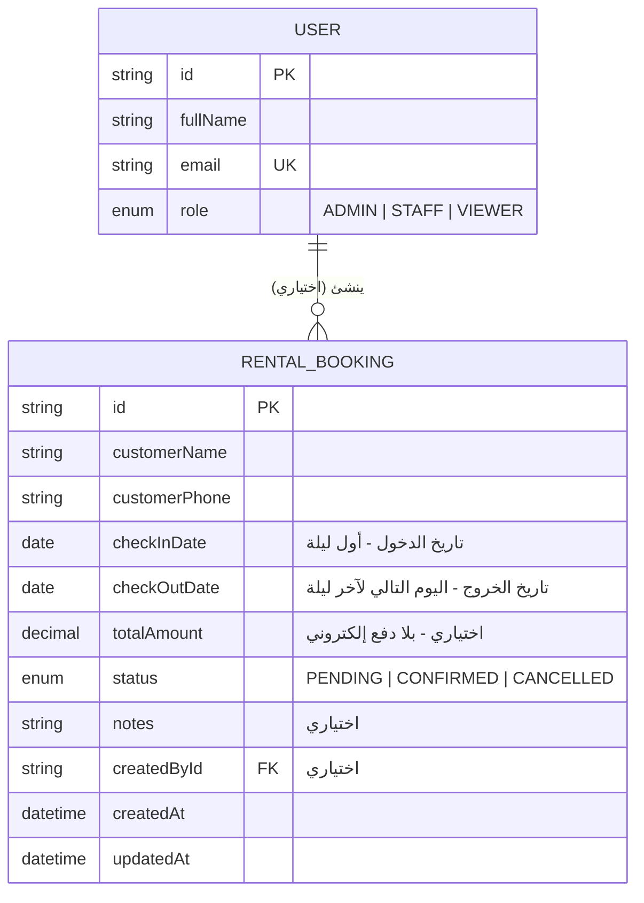
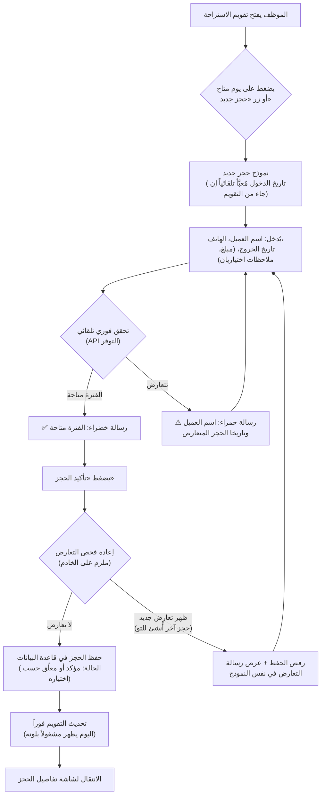
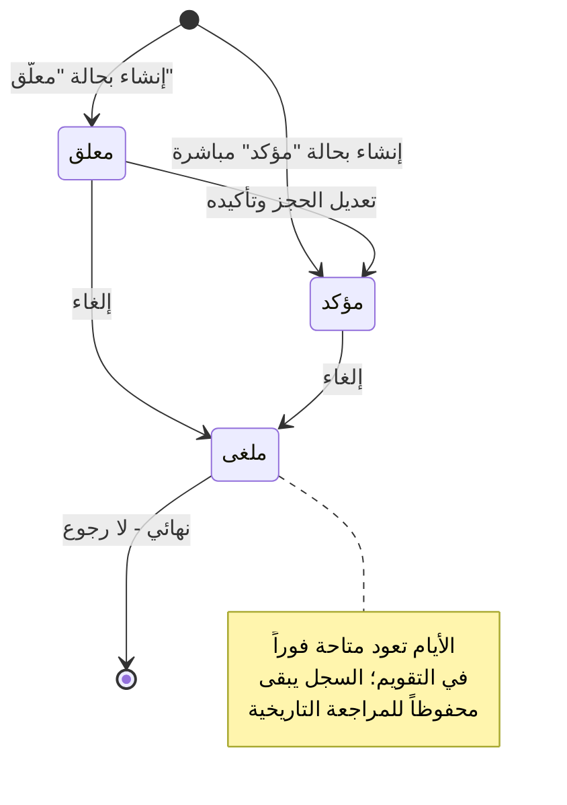

# مخططات UML - حجوزات الاستراحة

## 1. مخطط قاعدة البيانات (ERD)

المصدر الرسمي الوحيد هو `prisma/schema.prisma` .
جدولان فقط: `RentalBooking` و`User` (إضافة لسجل التدقيق `AuditLog`).
الحجز يرتبط اختيارياً بـ`User` لتتبّع من أنشأه.

### القيود الجوهرية على تكامل البيانات

- **لا حذف فعلي لأي حجز**: الإلغاء تغيير لحقل `status` إلى `CANCELLED` فقط
  (لا يوجد استدعاء `delete` على `RentalBooking` في أي مسار) - يبقى السجل
  التاريخي كاملاً للمراجعة.
- **منع التعارض ليس قيداً على مستوى قاعدة البيانات** (PostgreSQL/Prisma لا
  يدعمان قيد Exclusion على مدى تواريخ بسهولة عبر Prisma مباشرة) بل قاعدة
  عمل مُنفَّذة صراحة في كود التطبيق (`src/lib/rental.ts` +
  `app/rentals/actions.ts`) وتُفحص قبل كل `create`/`update` - انظر تسلسل
  التحقق في مخطط تدفق العمل أدناه.
- الفهرس المركّب `[checkInDate, checkOutDate]` يُسرِّع استعلام "هل تتعارض
  هذه الفترة مع أي حجز قائم؟" الذي يُنفَّذ في كل من: التحقق الفوري (API)،
  وحفظ الإنشاء/التعديل، وبناء شبكة التقويم الشهري.

## 2. مخطط تدفق العمل - إنشاء حجز جديد

## 3. مخطط تدفق العمل - دورة حياة الحجز (الحالات)

## 4. تصنيف المخططات ضمن UML

المخططان أعلاه يغطيان الجانبين المطلوبين صراحة في متطلبات المشروع:

- **مخطط قاعدة البيانات** → مخطط علاقات الكيانات (ERD)، وهو الشكل العملي
  المكافئ لمخطط الأصناف (Class Diagram) في نمذجة بيانات دائمة بقاعدة
  بيانات علائقية.
- **مخطط تدفق العمل للحجز** → مخطط تدفق (Flowchart) لعملية الإنشاء + مخطط
  حالات (State Diagram) لدورة حياة الحجز - يغطيان معاً كل انتقال ممكن
  لحالة الحجز من الإنشاء حتى الإلغاء أو البقاء نشطاً.
